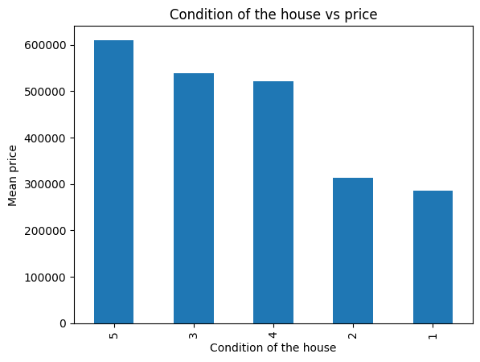
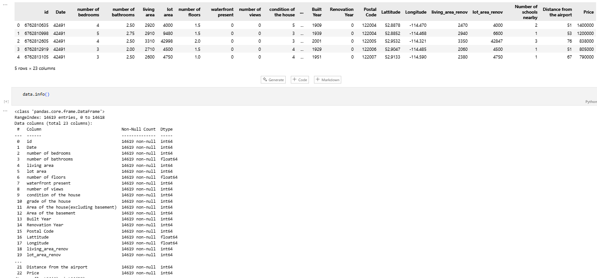
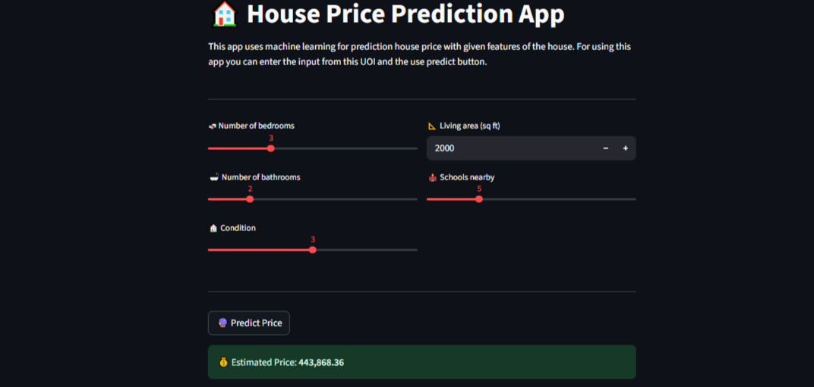

## 🏠 House Price Prediction
## 📌 Project Description
This project is a house price prediction application in India using machine learning. The model is trained using a public dataset from Kaggle containing various house features such as the number of bedrooms, bathrooms, building area, condition, and number of nearby schools.

## 📂 Dataset
Dataset : House Price India.csv (source: https://www.kaggle.com/datasets/sukhmandeepsinghbrar/house-prices-india)

Key features used :
- bedrooms – number of bedrooms
- bathrooms – number of bathrooms
- livingarea – building area (sq ft)
- condition – condition of the house (scale 1–5)
- numberofschools – number of schools near the house

Prediction target :
House price (in dataset currency)

## ⚙️ Methodology
#### 1. Data Preprocessing
- Selecting relevant features from the dataset
- Normalization/Standardization if necessary (depending on the model)
#### 2. Modeling
- Machine Learning models are saved in the model.pkl file (e.g., using Random Forest Regressor or other regression algorithms)
#### 3. Model Evaluation
- Using regression evaluation metrics such as R² Score, Mean Absolute Error (MAE), and Root Mean Squared Error (RMSE).
#### 4. Deployment
- The model is integrated with the Streamlit application for real-time house price prediction.

## 📦 Library
- pandas
- numpy
- scikit-learn
- joblib
- streamlit
- matplotlib

## 🎯 Application Usage
#### 1. House Price Prediction
- Provides a house price estimate based on property features: number of bedrooms, bathrooms, building area, house condition, and number of nearby schools.
- Helps prospective buyers, sellers, or property agents make informed pricing decisions.
#### 2. Interactive Web Application
- Built with Streamlit, it allows users to make price predictions directly in their browser without the need for coding or machine learning.
- Predictions are made in real time after entering property data.
#### 3. Property Data Analysis
- Can be used to view price trends based on specific factors (e.g., house condition or number of bedrooms).
- Visualization (bar plots) makes it easier to interpret the relationship between features and house prices.
#### 4. Real-World Application of Machine Learning
- Example of the end-to-end machine learning flow: from dataset collection, preprocessing, model training, evaluation, to deployment.
- Easily learning for those wanting to understand regression and price prediction.
#### 5. Data Source for Research Purposes
- Can be used by students, researchers, or data practitioners to experiment with property price prediction models.
- The Kaggle dataset makes it open and replicable.
#### 6. Flexible for Further Development
- The model can be upgraded with other algorithms or added new features (location, land area, year of construction, etc.).
- Streamlit applications can be deployed to Streamlit Cloud, Heroku, or Docker for widespread use.

### 📊 Plot Result
Bar plot of average home prices based on home condition from the dataset.



### 📈 Dataset View

Dataset of house prices along with structural information.



## 🚀 Run the Application
### 1. Clone Repository
```bash
git clone https://github.com/404-mind72/house-price-prediction.git
```
### 2. Install Requirements
```bash
pip install -r requirements.txt
```
### 3. Launch Streamlit App
```bash
streamlit run app.py
```
### 4. Browser Address
```bash
http://localhost:8501
```

### 🖥️ Application Usage
- Enter the number of bedrooms, bathrooms, building area, house condition, and number of nearby schools.
- Click Predict Price to see the estimated home price.
  


### 🚩Contributions
We greatly appreciate contributions to improve the model, add or enhance features, and optimize the deployment process. Please submit a pull request with a clear description of the changes.
